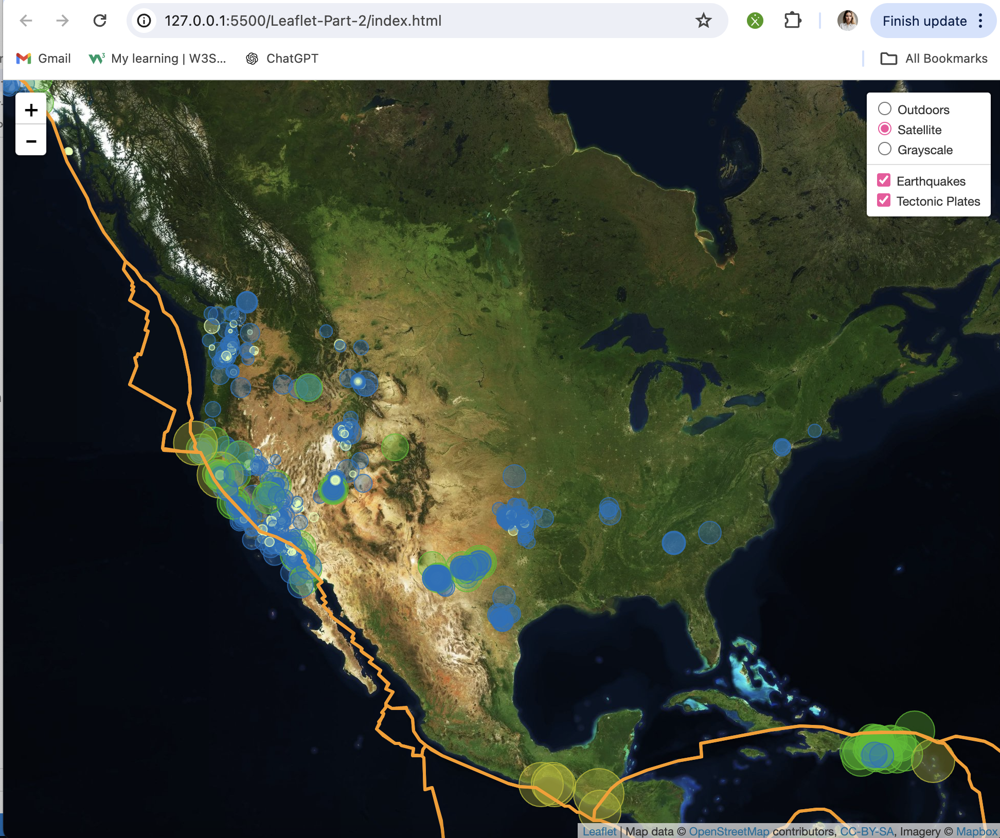

# Leaflet-challenge / Module 15
## Student Paola Moreno
### Part 1: Create the Earthquake Visualization

In this section, we visualize earthquake data using Leaflet.js. The visualization includes plotting earthquake locations on a map, with each earthquake marker providing information such as location, time, and magnitude. Additionally, a legend is provided to interpret the magnitude of earthquakes based on color.

To view the visualization, follow the steps below:

1. Clone or download this repository to your local machine.
2. Open the `index.html` file in a web browser.
3. Explore the map to see earthquake markers and interact with the legend to understand earthquake magnitudes.

The earthquake data is retrieved from the USGS (United States Geological Survey):
https://earthquake.usgs.gov/earthquakes/feed/v1.0/summary/all_day.geojson

API, and tectonic plate data is obtained from: https://docs.mapbox.com/

### Part 2: Gather and Plot More Data (Optional with no extra points earning)

- Obtained the tectonic plates dataset, most likely in GeoJSON format. (https://github.com/fraxen/tectonicplates).
- Place the downloaded tectonic plates data in the `Data` folder of the repository.
- Used Leaflet's L.geoJSON method to create a layer from the tectonic plates dataset.
- Added this layer was added to your map alongside the earthquake data.
- Defined multiple base map layers using different styles or sources, such as street maps, satellite maps, or grayscale maps.
- Each base map layer was created using Leaflet's L.tileLayer method.
- Created separate layers for earthquakes and tectonic plates.
- These layers were added to separate overlay groups, allowing them to be toggled on and off independently.
- Used Leaflet's L.control.layers method to create a layer control.
- The layer control was configured with base map and overlay map layers.
- Users could then interact with the layer control to switch between different base maps and overlay layers on the map.

This image demonstrates how you can extend your visualization to incorporate more data layers, enriching the overall presentation.

### References
Dataset created by the United States Geological Survey

